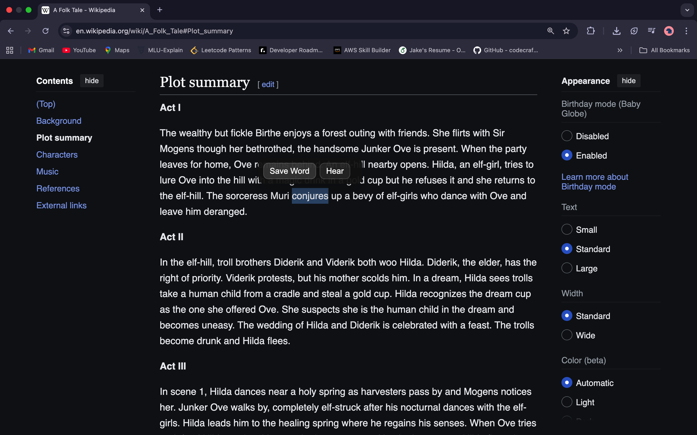
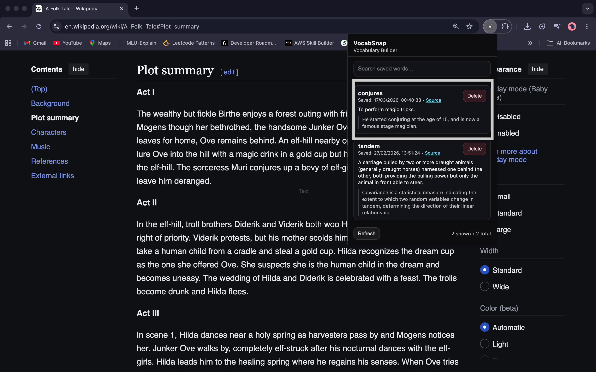

# VocabSnap – Chrome Vocabulary Builder

VocabSnap is a Chrome extension that helps you **save and review vocabulary while reading online**.  
Instead of interrupting your reading flow to search or note down words, you can instantly save them and revisit them later.

---

## Demo

---

## Features

- Save vocabulary while reading webpages or PDFs
- Popup appears when text is selected
- Right-click option to save words
- Stores words with source URL and timestamp
- Search and manage saved vocabulary
- Delete saved words easily
- Persistent storage using Chrome local storage

---

## Workflow

1. Select a word while reading a webpage or PDF.
2. A small popup appears with options to **Save Word** or **Hear pronunciation**.
3. The word gets stored locally with the **source page and timestamp**.
4. Click the extension icon to open the **VocabSnap dashboard**.
5. View, search, and manage your saved vocabulary.

---

## Tech Stack

- JavaScript
- Chrome Extensions API (Manifest V3)
- HTML
- CSS
- chrome.storage.local

---
## Installation (Try it locally)

1. Clone the repository  
   git clone https://github.com/23f2002227/VocabSnap.git 

2. Open Chrome and go to  
   chrome://extensions  

3. Enable **Developer Mode**

4. Click **Load Unpacked**

5. Select the project folder

The extension will now appear in your browser.

---

## Future Improvements

- Dictionary API integration  
- Flashcard-based vocabulary revision  
- Spaced repetition learning  
- Export saved words  
- Publish extension on the Chrome Web Store  

---

## Contributing

Suggestions and improvements are welcome. Feel free to open an issue or submit a pull request.

---

## License

MIT License
